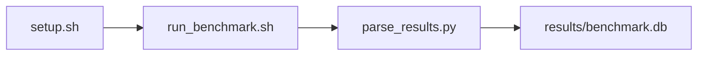

# SGLang Serving Latency Benchmark Benchmark

[](LICENSE)
[](https://github.com/garys-gpu-benchmarks/431-gpu-bench-nvidia-sglang-serving-latency-ubu2604/actions/workflows/ci.yml)

Target: Ubuntu 26.04 · NVIDIA · see Hardware Requirements. This is a host benchmark, not a laptop `pip install` project.

## Quick Start

```bash
git clone https://github.com/garys-gpu-benchmarks/431-gpu-bench-nvidia-sglang-serving-latency-ubu2604.git
cd 431-gpu-bench-nvidia-sglang-serving-latency-ubu2604
sudo bash setup.sh --assume-yes
bash run_benchmark.sh --profile smoke --validate
```
Results are written to `results/benchmark.db` and `results/summary.json`.

This workload is executed on the validation host after the repository is copied there. `setup.sh` and `run_benchmark.sh` do not open an outbound SSH session.

Prerequisites: Ubuntu 26.04; NVIDIA; Python 3.14.4; root or sudo for `setup.sh`. Framework: Bash, SQLite, Python, PyYAML, CUDA Runtime, PyTorch-CUDA, Hugging Face Transformers, Mistral-7B-v0.3, SGLang, HTTP client harness. Set HF_TOKEN when the model license requires a Hugging Face token. This is a host benchmark, not a laptop `pip install` project.



## 1. Overview

Locked run_benchmark.sh starts tiny_sglang_server.py (smoke) or sglang.launch_server (baseline/extended) on port 30000, then scripts/bench_serving.py with a concurrent ThreadPoolExecutor. model Mistral-7B-v0.3, yaml dtype, input_len, output_len, num_prompts, and max_concurrency (smoke 2, baseline 8) come from yaml. Honors the full num_prompts count. This is concurrent serving, in contrast to sequential 230 Sweep dimensions: model_name, dtype, tensor_parallel_size, schedule_policy, prompt_source, input_len, output_len, max_total_tokens.

## 2. What It Validates

- Validates concurrent serving latency percentiles and request throughput. This is not sequential prompt-response. Smoke uses scripts/tiny_sglang_server.py; baseline and extended use sglang.launch_server
- #1: E2E latency, ms (end_to_end_request_latency_p50_msec); is present and physically sensible.
- #2: TTFT, ms (ttft_p50_msec); is present and physically sensible.
- #3: TPOT, ms (time_per_output_token_tpot_p50_msec); is present and physically sensible.
- #4: ITL, ms (inter_token_latency_itl_p50_msec); is present and physically sensible.
- #5: Request throughput (request_throughput_requests_sec) is present and physically sensible.

## 3. Metrics Captured

- **#1: E2E latency, ms** — stored as `end_to_end_request_latency_p50_msec`.
- **#2: TTFT, ms** — stored as `ttft_p50_msec`.
- **#3: TPOT, ms** — stored as `time_per_output_token_tpot_p50_msec`.
- **#4: ITL, ms** — stored as `inter_token_latency_itl_p50_msec`.
- **#5: Request throughput** — stored as `request_throughput_requests_sec`.

## 4. Hardware Requirements

### Supported environment

- OS: Ubuntu 26.04
- GPU vendor: NVIDIA
- Framework family: Bash, SQLite, Python, PyYAML, CUDA Runtime, PyTorch-CUDA, Hugging Face Transformers, Mistral-7B-v0.3, SGLang, HTTP client harness
- Python: Python 3.14.4

### Reference validation environment

The tables below describe the machine used to generate the reference results. They are not a requirement that every user buy that exact cloud instance.

### System

Locked run_benchmark.sh starts tiny_sglang_server.py (smoke) or sglang.launch_server (baseline/extended) on port 30000, then scripts/bench_serving.py with a concurrent ThreadPoolExecutor. model Mistral-7B-v0.3, yaml dtype, input_len, output_len, num_prompts, and max_concurrency (smoke 2, baseline 8) come from yaml. Honors the full num_prompts count.

### GPU

Ubuntu 26.04 / NVIDIA / Bash, SQLite, Python, PyYAML, CUDA Runtime, PyTorch-CUDA, Hugging Face Transformers, Mistral-7B-v0.3, SGLang, HTTP client harness

## 5. Software Requirements

| Component | Version |
|---|---|
| OS | Ubuntu 26.04 |
| Kernel | kernel 7.0.0 |
| Python | Python 3.14.4 |
| ROCm | CUDA 13.3 |
| rocBLAS | cuBLAS (bundled with CUDA 13.3) |

Locked run_benchmark.sh starts tiny_sglang_server.py (smoke) or sglang.launch_server (baseline/extended) on port 30000, then scripts/bench_serving.py with a concurrent ThreadPoolExecutor. model Mistral-7B-v0.3, yaml dtype, input_len, output_len, num_prompts, and max_concurrency (smoke 2, baseline 8) come from yaml. Honors the full num_prompts count.

## 6. Installation

```bash
Smoke starts scripts/tiny_sglang_server.py; baseline and extended start python -m sglang.launch_server, then scripts/bench_serving.py
```

## 7. Running the Benchmark

```bash
Smoke starts scripts/tiny_sglang_server.py; baseline and extended start python -m sglang.launch_server, then scripts/bench_serving.py
```

**Validating results separately:**

```bash
export BENCHMARK_PYTHON=/usr/bin/python3.13  # optional
python3 -m venv .venv
source ".venv/bin/activate"
".venv/bin/python" scripts/validate_results.py
```

## 8. Output

### `results/benchmark.db` (SQLite)

raw_results.csv with one req_N row per request and a final summary row. Each request row also carries the run-level p50 metrics

check_name,status,e2e_ms,ttft_ms,tpot_ms,end_to_end_request_latency_p50_msec,ttft_p50_msec,time_per_output_token_tpot_p50_msec,inter_token_latency_itl_p50_msec,request_throughput_requests_sec
req_0,ok,350,30,10,340,28,9,8,6
summary,ok,340,28,9,340,28,9,8,6

```bash
Smoke starts scripts/tiny_sglang_server.py; baseline and extended start python -m sglang.launch_server, then scripts/bench_serving.py
```

### `results/summary.json`

Consolidated metrics from the most recent run — suitable for CI artifact upload or dashboard ingestion.

### `results/raw/<timestamp>.txt`

raw_results.csv with one req_N row per request and a final summary row. Each request row also carries the run-level p50 metrics

check_name,status,e2e_ms,ttft_ms,tpot_ms,end_to_end_request_latency_p50_msec,ttft_p50_msec,time_per_output_token_tpot_p50_msec,inter_token_latency_itl_p50_msec,request_throughput_requests_sec
req_0,ok,350,30,10,340,28,9,8,6
summary,ok,340,28,9,340,28,9,8,6

## 9. Baselines / Thresholds

Expected ranges and gates live in `config/benchmark_config.yaml` under `baselines:` or `thresholds:`. To update them, edit that file — never edit validation code directly.

## 10. Troubleshooting

**`setup.sh` missing collector**
Create cannot finish without `scripts/collect_workload.py`.

**`self_check` overlay rewritten**
Do not overwrite files listed in `results/overlay_lock.json`.

**Remote SSH drop during setup**
Reconnect and resume `bash setup.sh --assume-yes`. Do not wipe `.venv` or `.cache`.

## 11. NVIDIA H100 Coding Differences

Native NVIDIA CUDA workload. Execute on the stated Ubuntu release with the host NVIDIA driver and CUDA userspace. ROCm porting notes do not apply.

## Repository layout

```text
.
├── setup.sh
├── run_benchmark.sh
├── benchmark_specification.json
├── .github/workflows/      # thin CI callers (see Continuous Integration)
├── config/
├── scripts/
├── src/
├── tests/
├── docs/
├── results/
└── LICENSE
```

## Continuous Integration

| Workflow | Runs on | When | What it does |
|---|---|---|---|
| [CI](.github/workflows/ci.yml) | GitHub-hosted runner | every pull request, and every push to `main` | shellcheck, ruff, `bash -n`, `compileall`, `run_benchmark.sh --help`, specification schema, the results validator on a seeded fixture, required files, and actionlint. No GPU and no benchmark run. |
| [GPU Smoke Benchmark](.github/workflows/gpu-smoke.yml) | self-hosted runner labeled `gpu`, `nvidia`, `ubu2604` | only when started by hand: **Actions → GPU Smoke Benchmark → Run workflow** (choose `smoke`, `baseline` or `extended`) | Verifies the pre-provisioned GPU stack, records `results/environment.json` (driver, runtime, kernel, GPU), runs the profile with `--validate`, shows headline metrics on the run page, and uploads the results. |

Both files are short callers. The steps themselves live once, for every workload in the suite, in [`garys-gpu-benchmarks/shared-workflows`](https://github.com/garys-gpu-benchmarks/shared-workflows), pinned at `@v1`. The GPU workflow is never triggered by pull requests, so code from a fork cannot run on the GPU host.

### Running it as part of the NVIDIA Ubuntu 26.04 bundle

This repository is one of the 32 workloads in [`bundle-nvidia-ubuntu-2604`](https://github.com/garys-gpu-benchmarks/bundle-nvidia-ubuntu-2604), which holds them as git submodules. To put the whole bundle on a GPU host and run this workload from it:

```bash
git clone --recurse-submodules https://github.com/garys-gpu-benchmarks/bundle-nvidia-ubuntu-2604 /opt/benchmarks
cd /opt/benchmarks/431-gpu-bench-nvidia-sglang-serving-latency-ubu2604
bash run_benchmark.sh --profile smoke --validate
```
